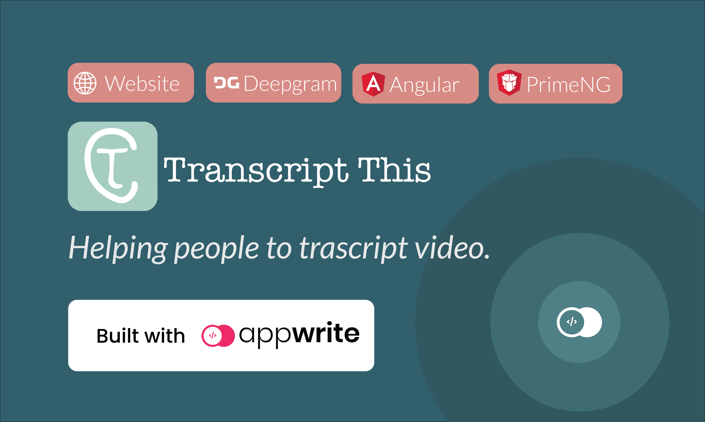
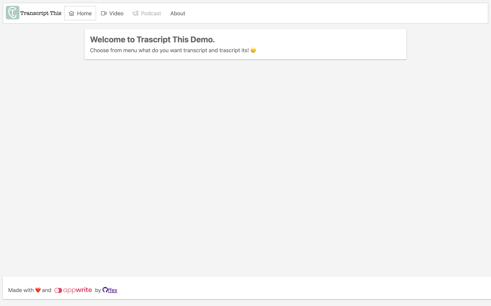
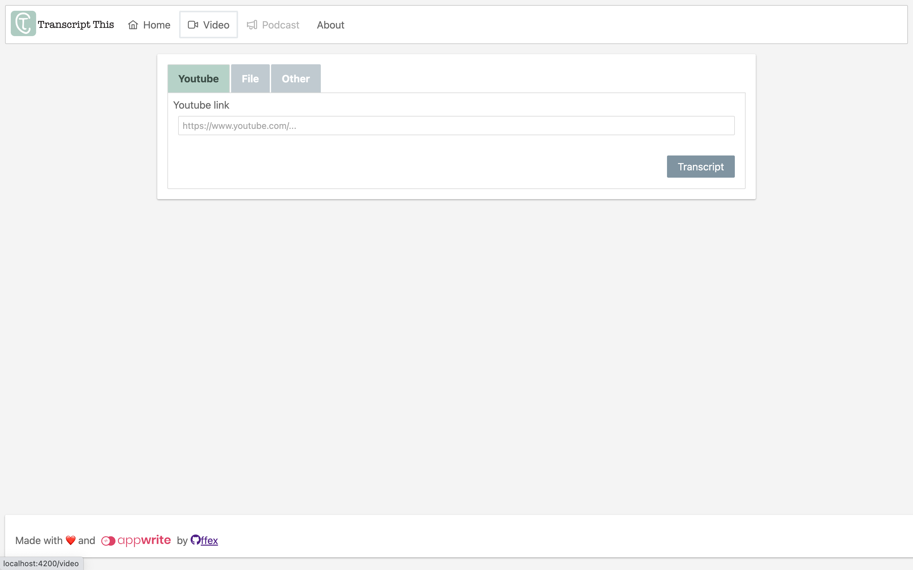
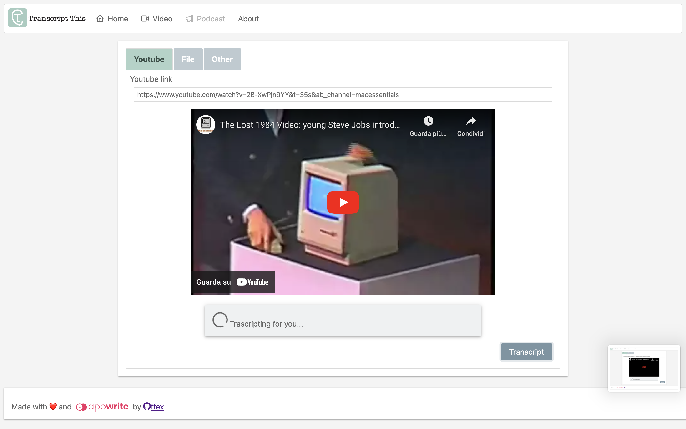
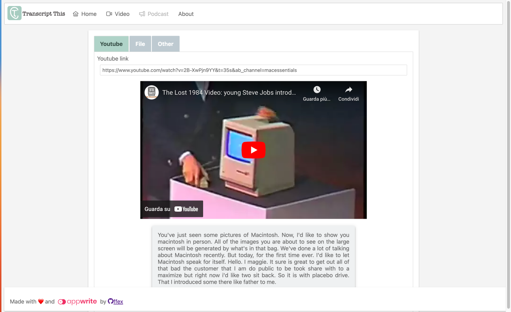
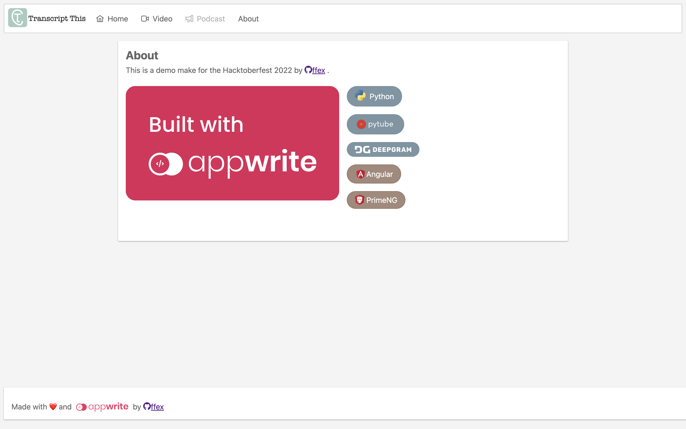

# 💬 Transcript This

> Helping people to trascript video.

Transcript This is a webapp usefull to transcript instantly a video from youtube.
The only thing to do is to paste a youtube video link and wait the transcription!

This application came into existance as a way to showcase amazing project that can be built using [Appwrite](https://appwrite.io/).

## 🧰 Tech Stack

- [Appwrite](https://appwrite.io/)
- [Python](https://www.python.org/)
- [Pytube](https://pytube.io/en/latest/)
- [Deepgram](https://deepgram.com/)
- [Angular](https://angular.io/)
- [PrimeNG](https://www.primefaces.org/primeng/)

## 🛠️ Setup

1. Setup [Appwrite](https://appwrite.io/) 1.0.3
2. Create project with ID `Transcriptions`
3. Use [Appwrite CLI](https://appwrite.io/docs/command-line) and run `appwrite deploy function --all`, all inside `backend` folder
4. Create `Internal` API key (give all scopes), and configure `APPWRITE_FUNCTION_API_KEY` and `APPWRITE_FUNCTION_ENDPOINT` on `Transcript Youtube` function
5. Configure `DEEPGRAM_SECRET_KEY` with the Deepgram API key

## 🏠 Development

1. Install dependencies `npm install`
2. Start Angular server `ng serve`

## 🖼️ Screenshots

## 🤖 Angular Generated Documentation

This project was generated with [Angular CLI](https://github.com/angular/angular-cli) version 14.2.6.

## Development server

Run `ng serve` for a dev server. Navigate to `http://localhost:4200/`. The application will automatically reload if you change any of the source files.

## Code scaffolding

Run `ng generate component component-name` to generate a new component. You can also use `ng generate directive|pipe|service|class|guard|interface|enum|module`.

## Build

Run `ng build` to build the project. The build artifacts will be stored in the `dist/` directory.

## Running unit tests

Run `ng test` to execute the unit tests via [Karma](https://karma-runner.github.io).

## Running end-to-end tests

Run `ng e2e` to execute the end-to-end tests via a platform of your choice. To use this command, you need to first add a package that implements end-to-end testing capabilities.

## Further help

To get more help on the Angular CLI use `ng help` or go check out the [Angular CLI Overview and Command Reference](https://angular.io/cli) page.
